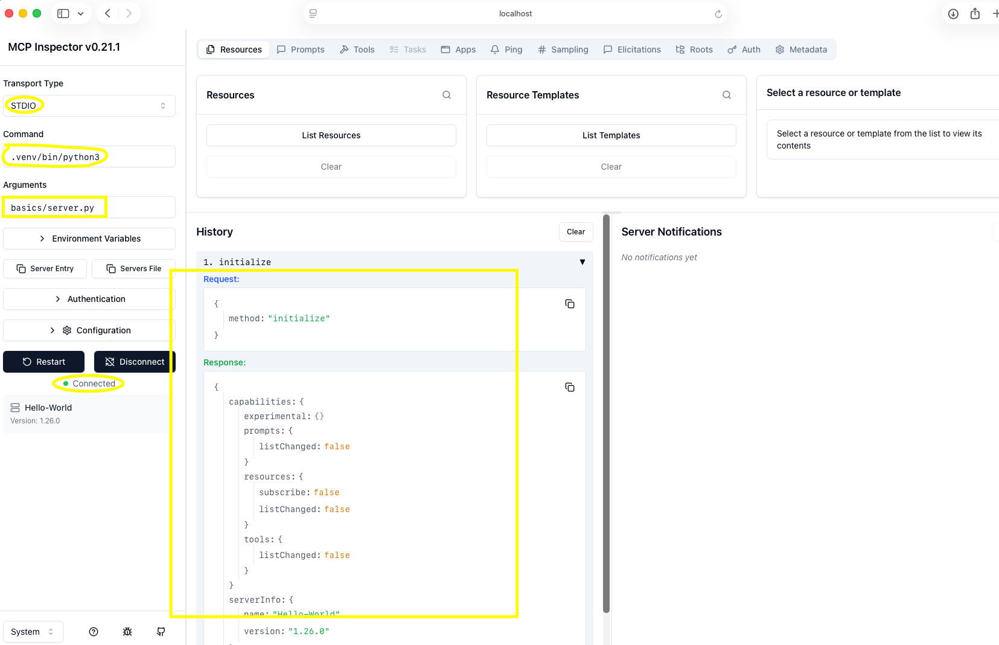
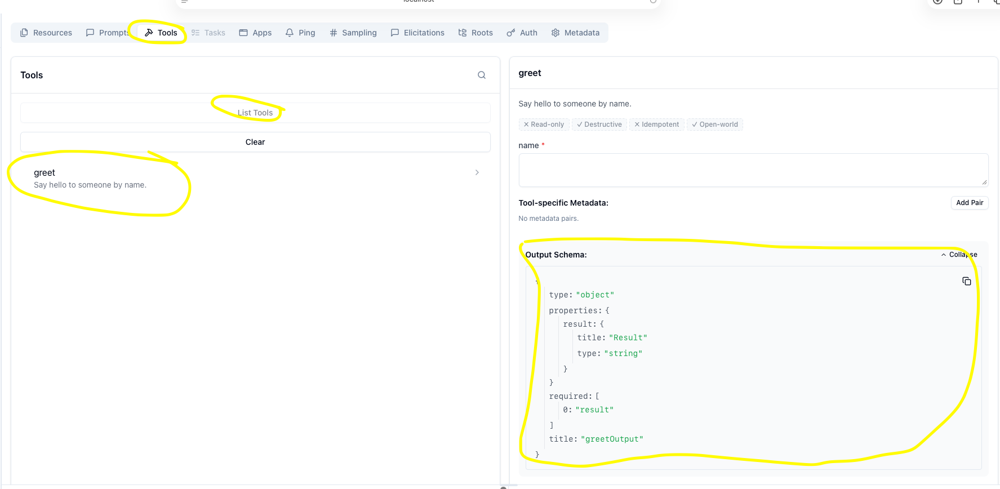
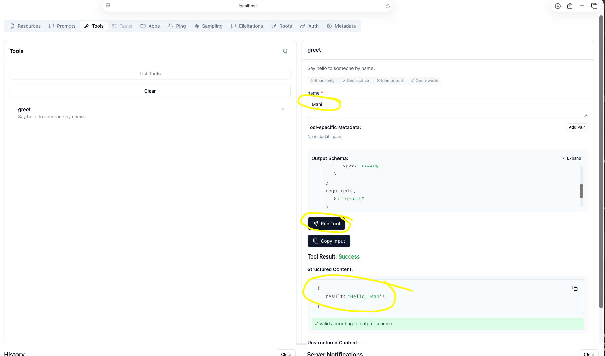

[← Back to README](../../README.md)

# Lesson 01 - Hello World MCP Server

## What we built
A minimal MCP server with a single tool, tested via the MCP Inspector.

---

## Step 1 — Set up the environment

Created a virtual environment and installed the MCP Python SDK:

```bash
python3 -m venv .venv
source .venv/bin/activate
pip install mcp
```

`mcp` pulls in everything needed: FastMCP, Pydantic (schema generation), anyio (async), uvicorn (HTTP, for later), and more.

---

## Step 2 — Write the server (`01_MCP_Primitives/01.server.py`)

```python
from mcp.server.fastmcp import FastMCP

mcp = FastMCP("Hello-World")

@mcp.tool()
def greet(name: str) -> str:
    '''Say hello to someone by name.'''
    return f"Hello, {name}!"

if __name__ == "__main__":
    mcp.run()
```

### What each part does

| Part | Purpose |
|------|---------|
| `from mcp.server.fastmcp import FastMCP` | Imports the high-level server class |
| `FastMCP("Hello-World")` | Creates the server; the string is its name (shown to clients) |
| `@mcp.tool()` | Registers the function as a callable MCP tool |
| Docstring | Becomes the tool's description — the AI uses this to decide when to call the tool |
| Type hints (`name: str -> str`) | MCP auto-generates the JSON schema from these |
| `mcp.run()` | Starts the server on stdio transport (stdin/stdout) |

---

## Step 3 — Run and test with MCP Inspector

```bash
npx @modelcontextprotocol/inspector .venv/bin/python3 01_MCP_Primitives/01.server.py
```

### Command breakdown
- `npx` — Node's package executor; runs an npm package without a global install
- `@modelcontextprotocol/inspector` — Anthropic's official browser-based MCP client
- `.venv/bin/python3 01_MCP_Primitives/01.server.py` — tells the inspector how to launch your server as a subprocess

### What the inspector does
1. Spawns your server as a child process
2. Connects via stdio (writes to its stdin, reads from its stdout)
3. Opens a browser UI to call tools interactively

### Screenshot 1 — Inspector connected

> **Capture:** The full inspector UI after it opens in the browser.
>
> **Highlight these areas:**
>
> - Left panel → Transport: `STDIO`, Command: `.venv/bin/python3`, Arguments: `01_MCP_Primitives/01.server.py`
> - Left panel → Server name: `Hello-World`, Version: `1.26.0`
> - Left panel → Green dot labeled **Connected**
> - Bottom panel → The JSON handshake showing `serverInfo`, `tools`, `resources`, `prompts` capabilities



---

## Step 4 — What happened under the hood

### Connection (automatic on startup)
The inspector and server performed an `initialize` handshake:
```
serverInfo: { name: "Hello-World", version: "1.26.0" }
capabilities: { tools: { listChanged: false }, resources: { ... }, prompts: { ... } }
```

### Screenshot 2 — Capability handshake JSON

> **Capture:** Scroll to the bottom JSON panel on the Resources tab.
>
> **Highlight these areas:**
>
> - `serverInfo: { name: "Hello-World" }` — your server name
> - `tools: { listChanged: false }` — server advertised tool support
> - `resources` and `prompts` blocks — other capabilities (empty for now)
> 


---

### Calling the tool

Click the **Tools** tab → **List Tools** → select `greet` → enter a name → click **Run Tool**.

### Screenshot 3 — Tool definition

> **Capture:** The Tools tab after clicking `greet`.
>
> **Highlight these areas:**
>
> - Tool name: `greet`
> - Description: `Say hello to someone by name.` — pulled from your docstring
> - Input field: `name` (type: string) — auto-generated from your type hint
> - Output Schema: `greetOutput` — auto-generated from return type hint



### Screenshot 4 — Tool result

> **Capture:** After clicking Run Tool with `name = "Mahi"`.
>
> **Highlight these areas:**
>
> - **Tool Result: Success** (green)
> - Structured Content: `{ result: "Hello, Mahi!" }`
> - `✓ Valid according to output schema`



---

### Tool call (what flew over the wire)

**Request** (Inspector → Server) — as seen in the inspector:
```json
{
  "method": "tools/call",
  "params": {
    "name": "greet",
    "arguments": {
      "name": "Mahi"
    },
    "_meta": {
      "progressToken": 1
    }
  }
}
```

> Note: The inspector UI shows a simplified view. Over the actual wire, MCP wraps this in JSON-RPC 2.0 with `"jsonrpc": "2.0"` and an `"id"` field — but the inspector abstracts that away and shows just the meaningful payload.
>
> `_meta.progressToken` is added by the inspector to track progress on long-running tool calls.

**Response** (Server → Inspector):
```json
{
  "result": "Hello, Mahi!"
}
```

---

## Key takeaways

1. Every MCP server needs: an instance, at least one primitive (tool/resource/prompt), and a transport to run on.
2. `FastMCP` handles all JSON-RPC boilerplate — you just write Python functions.
3. Docstrings and type hints are not optional decoration — they define the tool's contract with the client.
4. stdio transport = the server is a subprocess; the client owns its lifecycle.
