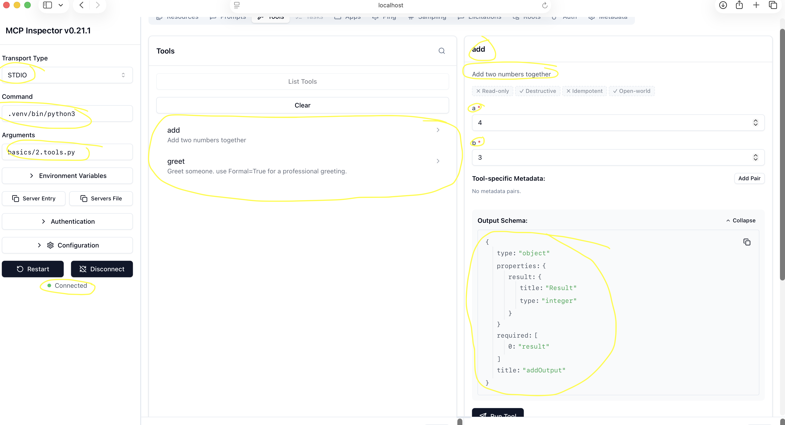
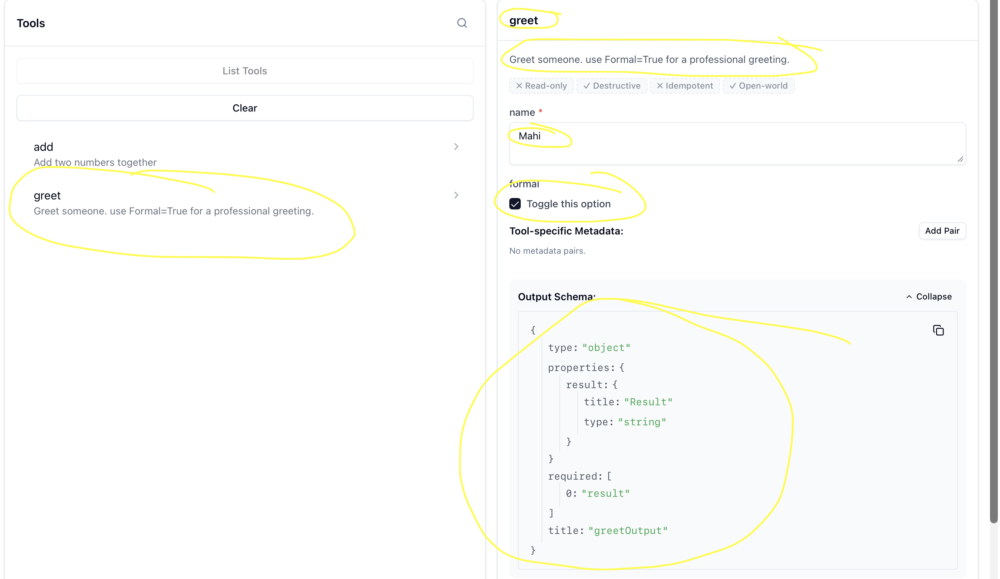

[← Back to README](../../README.md)

# Lesson 02 - Multiple Tools + Parameters

## What we built
A server with two tools demonstrating multiple parameter types, optional parameters, and how MCP auto-generates schemas from Python type hints.

---

## Step 1 — Server setup

Same boilerplate as Lesson 01, with a new server name:

```python
from mcp.server.fastmcp import FastMCP

mcp = FastMCP("tools-demo")
```

---

## Step 2 — Two tools with different parameter types

```python
@mcp.tool()
def add(a: int, b: int) -> int:
    """Add two numbers together."""
    return a + b

@mcp.tool()
def greet(name: str, formal: bool = False) -> str:
    """Greet someone. Use formal=True for a professional greeting."""
    if formal:
        return f"Good day, {name}"
    return f"Hey, {name}"

if __name__ == "__main__":
    mcp.run()
```

### What each part does

| Parameter | Type | Default | Behaviour in inspector |
|-----------|------|---------|----------------------|
| `a`, `b` | `int` | required | Number input field |
| `name` | `str` | required | Text input field |
| `formal` | `bool` | `False` | Toggle (optional — not required by caller) |

---

## Step 3 — Inspecting the tools

Run with the inspector:

```bash
npx @modelcontextprotocol/inspector .venv/bin/python3 basics/2.tools.py
```

### Screenshot 1 — `add` tool schema

> **Highlight these areas:**
>
> - Inputs `a` and `b` rendered as **number fields** — from `int` type hint
> - Both marked as **required** — no defaults



---

### Screenshot 2 — `greet` tool schema

> **Highlight these areas:**
>
> - `name` is a text field
> - `formal` renders as a **toggle** — from `bool` type hint
> - `formal` is **not required** — it has a default value of `False`



---

## Step 4 — Validation layers

### Client-side (inspector / Claude)
The inspector renders inputs based on the JSON schema. An `int` field won't accept text — the UI enforces it before the request is even sent.

### Server-side (Pydantic)
FastMCP uses Pydantic under the hood. Even if a rogue client bypassed the schema and sent a string for `a`, the server would reject it before your function runs.

---

## Key takeaways

1. Each `@mcp.tool()` decorated function becomes a separate tool — one server can expose many.
2. Python type hints → JSON Schema types automatically: `str`, `int`, `bool`, `float`, `list`, `dict` all work.
3. Parameters with defaults are **optional** in the schema; parameters without defaults are **required**.
4. Validation happens at two layers: client (schema) and server (Pydantic).
