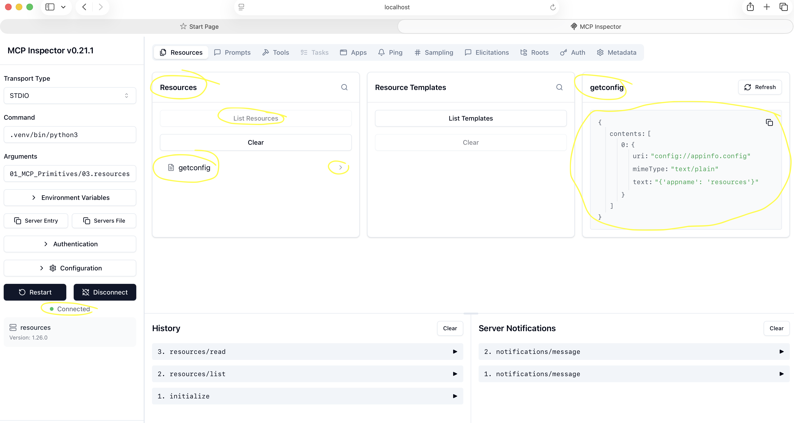
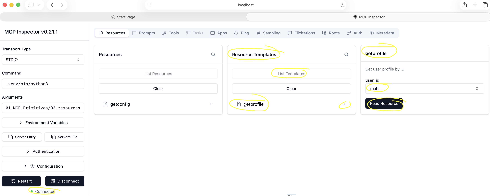
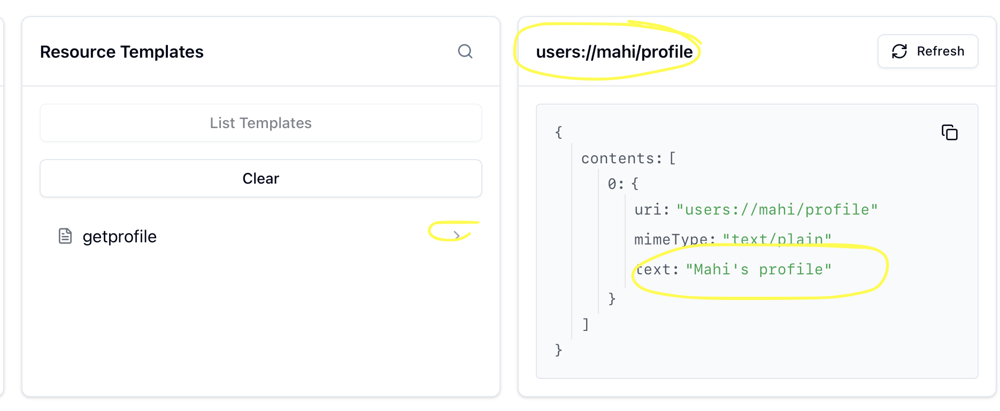

[← Back to README](../../README.md)

# Lesson 03 - MCP Resources

## What we built
A server exposing two resources — one static (fixed URI) and one dynamic (URI template with a variable) — tested via the MCP Inspector.

---

## Step 1 — Server setup

Same boilerplate as previous lessons:

```python
from mcp.server.fastmcp import FastMCP

mcp = FastMCP("resources")
```

---

## Step 2 — Static resource

```python
@mcp.resource("config://appinfo.config")
def getconfig() -> str:
    """App configuration."""
    return "{'appname': 'resources'}"
```

### What each part does

| Part | Purpose |
|------|---------|
| `@mcp.resource("config://appinfo.config")` | Registers the function as a resource; the string is its URI |
| URI format `scheme://path` | Convention — the scheme hints at the type of data |
| Return value | The resource content returned to the client |
| Docstring | Becomes the resource description shown in the inspector |

---

## Step 3 — Dynamic resource

```python
@mcp.resource("users://{user_id}/profile")
def getprofile(user_id) -> str:
    """Get a user's profile by ID."""
    if user_id == "mahi":
        return "Mahi's profile"
    return "Invalid profile"
```

### What each part does

| Part | Purpose |
|------|---------|
| `{user_id}` in the URI | A variable segment — MCP extracts it and passes it into the function |
| `user_id` parameter | Receives the value extracted from the URI at runtime |
| Fallback return | Handles unknown user IDs gracefully |

---

## Step 4 — Testing in the Inspector

```bash
npx @modelcontextprotocol/inspector .venv/bin/python3 01_MCP_Primitives/03.resources.py
```

### Static resource
Go to the **Resources** tab → **List Resources** → select `config://appinfo.config` → **Read Resource**.

### Screenshot 1 — Static resource content

> **Capture:** The Resources tab after reading `config://appinfo.config`.
>
> **Highlight these areas:**
>
> - URI: `config://appinfo.config`
> - Resource content returned in the text field



---

### Dynamic resource
Dynamic resources do **not** appear in the Resources list — the inspector has no way to enumerate infinite possible URIs.

Go to the **Resource Templates** tab instead → select `getprofile` → enter a `user_id` (e.g. `mahi`) → fetch it.

### Screenshot 2 — Resource Templates tab

> **Capture:** The Resource Templates tab showing the `getprofile` template.
>
> **Highlight these areas:**
>
> - Template URI: `users://{user_id}/profile`
> - The `user_id` input field



---

### Screenshot 3 — Dynamic resource result

> **Capture:** After fetching `users://mahi/profile`.
>
> **Highlight these areas:**
>
> - Full resolved URI: `users://mahi/profile`
> - Resource content returned for the given user ID



---

## Key takeaways

1. Resources expose **read-only data** — the client reads them, the model doesn't call them like functions.
2. URI is just an address you define — follow the `scheme://path` convention to keep it readable.
3. Static resources have a fixed URI and are listable. Dynamic resources use URI templates and are only accessible when the caller provides the variable values.
4. The `{variable}` in a URI template is automatically extracted by MCP and passed into your function as a parameter — the client provides the value.
5. Use a **resource** for read-only data (app config, user profiles, file contents). Use a **tool** when an action or side effect is involved (sending email, calling an API, writing data).

---

## Retrospective

**Q: What's the fundamental difference between a Tool and a Resource?**
A tool performs an action and can have side effects. A resource exposes read-only data — the client fetches it, nothing is changed.

**Q: Why doesn't a dynamic resource appear in the Resources list?**
Because the URI contains a variable — the inspector can't list it without knowing all possible values upfront. It appears under Resource Templates instead, where you provide the variable to construct the full URI.

**Q: Where does the `{user_id}` value come from at runtime?**
The client provides it by constructing the full URI (e.g. `users://mahi/profile`). MCP extracts the variable from the URI and passes it into the function as a parameter.

**Q: When would you use a resource vs a tool in a real server?**
Use a resource for simple read-only data — app metadata, user profiles, configuration. Use a tool when an action needs to be performed — reading emails and summarising them involves a side effect (sending the summary), so that's a tool.
