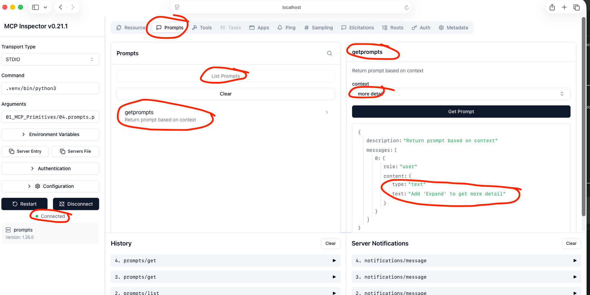
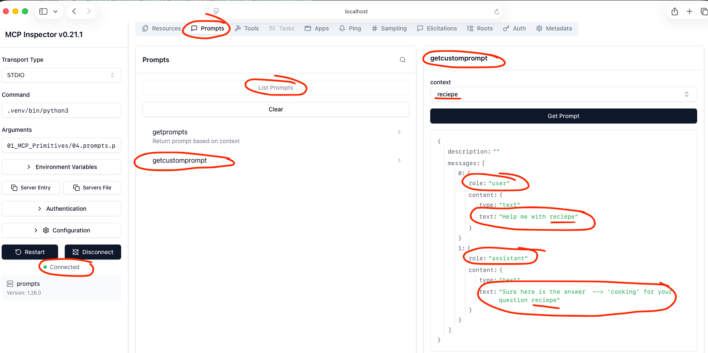

[← Back to README](../../README.md)

# Lesson 04 - MCP Prompts

## What we built
A server exposing two prompts — one single-turn (plain string return) and one multi-turn (user + assistant messages) — tested via the MCP Inspector.

---

## Step 1 — Server setup

Same boilerplate as previous lessons:

```python
from mcp.server.fastmcp import FastMCP

mcp = FastMCP("prompts")
```

---

## Step 2 — Single-turn prompt

```python
@mcp.prompt()
def getprompts(context: str) -> str:
    '''Return prompt based on context'''
    return "Add 'Expand' to get more detail"
```

### What each part does

| Part | Purpose |
|------|---------|
| `@mcp.prompt()` | Registers the function as a prompt |
| `context: str` | Parameter the caller passes in when requesting the prompt |
| Return `str` | FastMCP auto-wraps it into a `user` message in the MCP message format |
| Docstring | Becomes the prompt description shown in the inspector |

> **Note:** Returning a plain `str` is the simplest approach. FastMCP automatically wraps it into `{ role: "user", content: { type: "text", text: "..." } }`.

---

## Step 3 — Multi-turn prompt

```python
from mcp.server.fastmcp.prompts.base import UserMessage, AssistantMessage

@mcp.prompt()
def getcustomprompt(context: str):
    return [
        UserMessage(f"Help me with {context}"),
        AssistantMessage(f"Sure here is the answer --> 'cooking' for your question {context}")
    ]
```

### What each part does

| Part | Purpose |
|------|---------|
| `UserMessage(...)` | Creates a message with `role: "user"` |
| `AssistantMessage(...)` | Creates a message with `role: "assistant"` |
| Return `list` | Returns multiple messages to pre-script a conversation turn |
| `from mcp.server.fastmcp.prompts.base` | FastMCP's own types — use these, not `mcp.types.PromptMessage` |

> **Gotcha:** Importing `PromptMessage` from `mcp.types` and returning it causes double-serialization — FastMCP doesn't know how to unwrap it and treats it as a plain string. Always use FastMCP's own `UserMessage` / `AssistantMessage` for multi-turn prompts.

---

## Step 4 — Testing in the Inspector

```bash
npx @modelcontextprotocol/inspector .venv/bin/python3 01_MCP_Primitives/04.prompts.py
```

Go to the **Prompts** tab → **List Prompts** → select a prompt → enter a `context` value → **Get Prompt**.

### Screenshot 1 — Single-turn prompt result

> **Capture:** The Prompts tab after fetching `getprompts`.
>
> **Highlight these areas:**
>
> - The `context` input field
> - Response: single message with `role: "user"`
> - The auto-wrapped text content



---

### Screenshot 2 — Multi-turn prompt result

> **Capture:** The Prompts tab after fetching `getcustomprompt`.
>
> **Highlight these areas:**
>
> - Response: two messages — `role: "user"` and `role: "assistant"`
> - The `context` value interpolated into both messages



---

## Key takeaways

1. Prompts are **reusable conversation templates** — they shape what gets said and how, not what gets done.
2. Returning a plain `str` is the simplest approach; FastMCP auto-wraps it as a `user` message.
3. For multi-turn prompts, return a `list` of `UserMessage` / `AssistantMessage` — import these from `mcp.server.fastmcp.prompts.base`.
4. `mcp.types.PromptMessage` is the low-level protocol type — FastMCP doesn't unwrap it correctly, causing double-serialization. Use FastMCP's own types instead.
5. Prompts **shape input** to the AI; tools **perform actions**. In practice, both are often used together.

---

## Retrospective

**Q: What is an MCP Prompt and how is it different from a Tool?**
A prompt is a reusable template that structures the conversation — it shapes what the user or assistant says. A tool performs an action or side effect. Prompts return messages; tools return results.

**Q: Why does FastMCP wrap a plain `str` return into a `messages` array with `role: "user"`?**
The MCP message protocol always expects a structured list of messages with a role and content. FastMCP converts the plain string into this format automatically so you don't have to write the boilerplate.

**Q: What's the difference between a single-turn and multi-turn prompt?**
A single-turn prompt produces one user message. A multi-turn prompt pre-scripts multiple messages — user and assistant — essentially templating part of the conversation before the model responds.

**Q: Why did `mcp.types.PromptMessage` cause issues but `fastmcp.prompts.base.UserMessage` worked?**
`mcp.types.PromptMessage` is the raw MCP protocol type — FastMCP doesn't know how to unwrap it and serializes it as a plain string, causing double-wrapping. `UserMessage` and `AssistantMessage` are FastMCP's own abstractions, which it handles correctly.

**Q: When would you use a Prompt over a Tool?**
Use a prompt when you want to scaffold or frame the conversation — provide context, set tone, or structure the question. Use a tool when an action needs to be performed independently or in response to user input.
